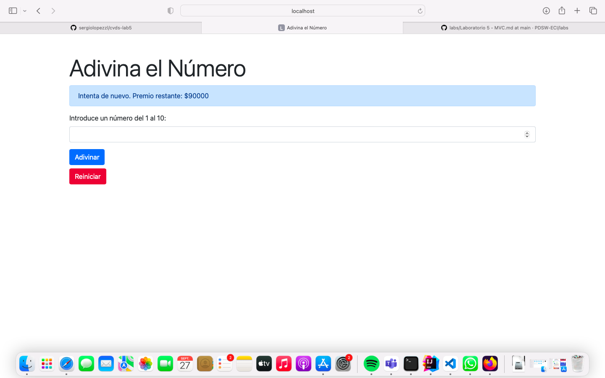

# LABORATORIO 5 - SPRING MVC INTRODUCTION

## INTEGRANTES

### Andrés Felipe Arias Ajiaco
### Sergio Daniel Lopez Vargas

## RESPUESTAS
## PARTE 1
#### 3. Petición GET


¿Qué codigo de error sale?, revise el significado del mismo en la lista de códigos de estado HTTP.
  
El código de error "301 Moved Permanently" es una respuesta HTTP que indica que la ubicación de una página web o recurso ha cambiado de manera permanente. Esto significa que el servidor web ha redirigido la solicitud a una nueva URL, y los navegadores y aplicaciones deben actualizar sus marcadores o enlaces a esa nueva ubicación. A continuación, te proporciono una descripción de algunos de los códigos de respuesta HTTP más comunes:

¿Qué otros códigos de error existen?, ¿En qué caso se manejarán?

Códigos 200 (Éxito):
* 200 OK: Indica que la solicitud se ha completado correctamente, y el servidor está devolviendo los datos solicitados.
  
Códigos 300 (Redirecciones):
* 301 Moved Permanently: El recurso solicitado se ha movido permanentemente a una nueva ubicación. Los navegadores deben actualizar sus marcadores y enlaces.
* 302 Found (o 302 Found Temporary): Indica una redirección temporal. Los navegadores pueden mantener el enlace original en su caché.
* 304 Not Modified: Indica que la página no ha cambiado desde la última vez que se accedió a ella, y se puede usar la versión en caché.

Códigos 400 (Errores del Cliente):
* 400 Bad Request: La solicitud enviada al servidor es incorrecta o no puede ser procesada.
* 401 Unauthorized: Se requiere autenticación para acceder al recurso.
* 403 Forbidden: El servidor comprende la solicitud, pero no permite el acceso al recurso.
* 404 Not Found: El recurso solicitado no se encuentra en el servidor.

Códigos 500 (Errores del Servidor):
* 500 Internal Server Error: Indica un error en el servidor que impide que la solicitud se complete correctamente.
* 502 Bad Gateway: El servidor, mientras actuaba como puerta de enlace o proxy, recibió una respuesta no válida del servidor ascendente.
* 503 Service Unavailable: El servidor no puede atender la solicitud en este momento debido a una sobrecarga o mantenimiento.
  
#### 4. Realice una nueva conexión con telnet:

```yml
Host: www.httpbin.org
Puerto: 80
Versión HTTP: 1.1
```

Solicite (GET) el recurso /html. ¿Qué se obtiene como resultado?


#### 5. contar el número de caracteres


### ¿Cuál esla diferencia entre los verbos GET y POST? ¿Qué otros tipos de peticiones existen?
Los métodos **GET** y **POST** son dos de los métodos de petición más comunes en el protocolo HTTP, pero tienen algunas diferencias clave:

- **GET**: Este método solicita una representación de un recurso específico. Los datos que se envían al servidor se escriben en la misma dirección URL. Es seguro y se puede guardar junto a la dirección URL como marcador. Sin embargo, los parámetros URL que se envían quedan visibles en la barra de direcciones del navegador y son accesibles sin clave en el historial de navegación, en el caché y en el log de los servidores. Además, su capacidad es limitada: dependiendo del servidor y del navegador, no es posible introducir más de 2000 caracteres.

- **POST**: Este método se utiliza para enviar una entidad a un recurso en específico, causando a menudo un cambio en el estado o efectos secundarios en el servidor. Los parámetros se introducen en la solicitud HTTP para el servidor, por lo que no quedan visibles para el usuario. Además, la capacidad del método POST es ilimitada.

Además de GET y POST, existen otros métodos de petición HTTP:

- **PUT**: Este método reemplaza todas las representaciones actuales del recurso de destino con la carga útil de la petición.
- **DELETE**: Este método borra un recurso en específico.
- **HEAD**: Este método pide una respuesta idéntica a la de una petición GET, pero sin el cuerpo de la respuesta.
- **CONNECT**: Este método establece un túnel hacia el servidor identificado por el recurso.
- **OPTIONS**: Este método es utilizado para describir las opciones de comunicación para el recurso de destino.
- **TRACE**: Este método realiza una prueba de bucle de retorno de mensaje a lo largo de la ruta al recurso de destino.
- **PATCH**: Este método es utilizado para aplicar modificaciones parciales a un recurso.

Cada uno de estos métodos implementa una semántica diferente, pero algunas características similares son compartidas por un grupo de ellos. Por ejemplo, un método de petición puede ser seguro, idempotente o cacheable.
[getVSpost](https://www.ionos.es/digitalguide/paginas-web/desarrollo-web/get-vs-post/)

#### 6. Curl: 

```sh
$ curl "www.httpbin.org"
```


Utilice ahora el parámetro -v y con el parámetro -i:

```sh
$ curl -v www.httpbin.org
```


```sh
$ curl -i www.httpbin.org
```


Los parámetros `-v` e `-i` en el comando `curl` tienen diferentes usos:

- **-v**: Este parámetro se utiliza para habilitar el modo detallado o "verbose". Cuando se utiliza este parámetro, `curl` proporciona información adicional y detallada sobre la transferencia de datos, incluyendo los detalles de la solicitud y la respuesta. Es útil para depurar y entender lo que está sucediendo bajo el capó¹.

- **-i**: Este parámetro se utiliza para incluir la cabecera HTTP en la salida. `curl` mostrará los encabezados de respuesta HTTP junto con los datos del cuerpo¹.

### PARTE 2
> * **¿Por qué MVC obtiene ese nombre?**

MVC se llama así debido a su arquitectura de tres componentes principales:

**Modelo (Model):** Representa los datos y la lógica empresarial de la aplicación.

**Vista (View):** Presenta los datos al usuario y maneja la interfaz de usuario.

**Controlador (Controller):** Controla las solicitudes del usuario, interactúa con el modelo y selecciona la vista adecuada para mostrar los resultados.
> * **¿Cuáles son las ventajas de usar MVC?**

Algunas de las ventajas de utilizar la arquitectura MVC en aplicaciones web incluyen:

**Separación de preocupaciones:** MVC divide la aplicación en componentes separados, lo que facilita la gestión y el mantenimiento del código.

**Reutilización de código:** Los componentes del modelo y la vista pueden reutilizarse en diferentes partes de la aplicación o en proyectos futuros.

**Escalabilidad:** Facilita la escalabilidad de la aplicación al permitir la sustitución o ampliación de componentes sin afectar a otros.

**Pruebas unitarias:** Permite realizar pruebas unitarias más eficaces y facilita la automatización de pruebas.
Colaboración entre equipos: Permite que equipos diferentes trabajen en paralelo en diferentes partes de la aplicación.
> * **¿Qué diferencia tiene la estructura de directorios de este proyecto comparado con las de proyectos pasados (con solo maven y java EE)?**

La estructura de directorios en un proyecto Spring MVC es diferente de la de proyectos Maven y Java EE debido a la naturaleza específica de Spring MVC. En un proyecto Spring MVC, se suelen encontrar carpetas y paquetes como:

**src/main/java:** Contiene las clases Java, incluyendo controladores y modelos.

**src/main/resources:** Contiene recursos como archivos de configuración XML y propiedades.

**src/main/webapp:** Aquí se encuentran los archivos web, como páginas JSP o archivos HTML.

**WEB-INF:** Contiene archivos de configuración de Spring y configuraciones específicas de Servlet.
    Esta estructura está diseñada para facilitar la gestión de componentes MVC y la configuración de Spring.
> * **¿Qué anotaciones usaste y cuál es la diferencia entre ellas?**

En un proyecto Spring MVC, se utilizan diversas anotaciones para configurar y gestionar controladores, vistas y otras partes de la aplicación. Algunas anotaciones comunes incluyen:

**@Controller:** Anota una clase como controlador.

**@RequestMapping:** Define una URL o patrón de URL que se asigna a un método del controlador.

**@ModelAttribute:** Utilizada para asociar un método o parámetro de método con un modelo.

**@GetMapping, @PostMapping, etc.:** Anotaciones para especificar los métodos HTTP que maneja un controlador.

**@Autowired:** Utilizada para inyectar dependencias en los controladores u otros componentes de Spring.

**@RequestMapping:** Permite especificar una URL base para todos los métodos de un controlador.

Estas anotaciones son fundamentales para definir cómo se manejan las solicitudes HTTP y cómo se interactúa con el modelo y la vista en una aplicación Spring MVC.

### PARTE3


> * **¿Qué es RESTful?**

RESTful (Representational State Transfer) es un estilo arquitectónico para el diseño de servicios web que se basa en principios y restricciones bien definidos. Fue propuesto por Roy Fielding en su tesis doctoral en 2000 y se ha convertido en un enfoque ampliamente utilizado para desarrollar servicios web que sean simples, escalables y eficientes.

### PARTE4

> * **¿Qué pasa si abro el sitio de juegos en dos navegadores difententes?**

Se abre normalmente en los dos navegadores:



> * **Si quisiera qué a cada jugador le aparecieran independientemente sus respectivos saldos. ¿Qué habría que hacer?**

Se puede utilizar una base de datos para almacenar la información del jugador, incluido su saldo. Cada jugador tendría su propio registro en la base de datos, y el saldo se actualizaría en función de sus acciones en el juego.

